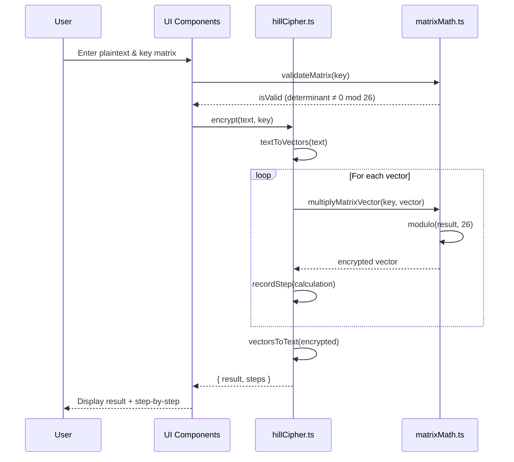

# Design Document: Hill Cipher Educational App

## Overview

An interactive Next.js single-page application that teaches the Hill cipher encryption algorithm through visual demonstrations and step-by-step calculations. The app uses TypeScript for type safety, mathjs for matrix operations modulo 26, Framer Motion for pedagogical animations, and Tailwind CSS for a cryptographic terminal aesthetic.

## Main Algorithm/Workflow



## Core Interfaces/Types

```typescript
// lib/types.ts

export type Matrix = number[][];

export type Vector = number[];

export interface CalculationStep {
  type: 'vector_conversion' | 'matrix_multiplication' | 'modulo_operation' | 'inverse_calculation';
  description: string;
  input: {
    text?: string;
    matrix?: Matrix;
    vector?: Vector;
    value?: number;
  };
  output: {
    vector?: Vector;
    matrix?: Matrix;
    value?: number;
    text?: string;
  };
  intermediateSteps?: string[];
}

export interface CipherResult {
  result: string;
  steps: CalculationStep[];
  keyMatrix: Matrix;
  inverseMatrix?: Matrix;
}

export interface MatrixValidation {
  isValid: boolean;
  determinant: number;
  gcd: number;
  error?: string;
}
```

## Key Functions with Formal Specifications

### Function 1: modInverse()

```typescript
function modInverse(a: number, m: number): number | null
```

**Preconditions:**
- `a` is an integer
- `m` is a positive integer (m = 26 for Hill cipher)
- `gcd(a, m) = 1` (a and m must be coprime)

**Postconditions:**
- Returns integer `x` where `(a * x) mod m = 1`
- Returns `null` if no modular inverse exists
- If result exists: `0 ≤ result < m`

**Loop Invariants:**
- Extended Euclidean algorithm maintains: `gcd(a, m) = gcd(r_i, r_{i+1})`
- Coefficients satisfy: `a * x_i + m * y_i = r_i` at each iteration

### Function 2: matrixDeterminant()

```typescript
function matrixDeterminant(matrix: Matrix): number
```

**Preconditions:**
- `matrix` is a square matrix (n × n)
- `matrix.length > 0`
- All rows have equal length: `matrix[i].length === matrix.length` for all i

**Postconditions:**
- Returns determinant value as integer
- For 2×2 matrix: `det = (a*d - b*c)`
- For 3×3 matrix: uses cofactor expansion
- Result is computed before modulo operation

**Loop Invariants:** N/A (recursive algorithm)

### Function 3: matrixInverseMod26()

```typescript
function matrixInverseMod26(matrix: Matrix): Matrix | null
```

**Preconditions:**
- `matrix` is a square matrix (2×2 or 3×3)
- All elements are integers in range [0, 25]
- `gcd(det(matrix), 26) = 1` (determinant coprime with 26)

**Postconditions:**
- Returns inverse matrix `M^(-1)` where `(M * M^(-1)) mod 26 = I` (identity matrix)
- Returns `null` if matrix is not invertible mod 26
- All elements in result are in range [0, 25]

**Loop Invariants:**
- For each element calculation: intermediate values remain valid integers
- Modulo operation maintains: `0 ≤ result[i][j] < 26`

### Function 4: textToVectors()

```typescript
function textToVectors(text: string, blockSize: number): Vector[]
```

**Preconditions:**
- `text` is a non-empty string containing only uppercase letters A-Z
- `blockSize` is 2 or 3 (matching key matrix dimension)
- `text.length > 0`

**Postconditions:**
- Returns array of vectors, each of length `blockSize`
- Each vector element is in range [0, 25] (A=0, B=1, ..., Z=25)
- If `text.length % blockSize ≠ 0`, text is padded with 'X'
- Total vectors: `Math.ceil(text.length / blockSize)`

**Loop Invariants:**
- All processed characters are converted to [0, 25]
- Vector count increases by 1 for each `blockSize` characters processed

### Function 5: encryptVector()

```typescript
function encryptVector(keyMatrix: Matrix, vector: Vector): Vector
```

**Preconditions:**
- `keyMatrix` is n×n matrix where n = vector.length
- `vector.length` equals `keyMatrix.length`
- All vector elements are in range [0, 25]
- All matrix elements are in range [0, 25]

**Postconditions:**
- Returns encrypted vector of same length as input
- Each element computed as: `result[i] = (Σ keyMatrix[i][j] * vector[j]) mod 26`
- All result elements are in range [0, 25]

**Loop Invariants:**
- For row i: sum accumulates `keyMatrix[i][0..j] * vector[0..j]`
- Partial sums remain valid integers before modulo operation

## Algorithmic Pseudocode

### Main Encryption Algorithm

```typescript
function encrypt(plaintext: string, keyMatrix: Matrix): CipherResult {
  // Step 1: Validate and prepare input
  const cleanText = plaintext.toUpperCase().replace(/[^A-Z]/g, '');
  const blockSize = keyMatrix.length;
  const steps: CalculationStep[] = [];
  
  // Step 2: Convert text to numerical vectors
  const vectors = textToVectors(cleanText, blockSize);
  steps.push({
    type: 'vector_conversion',
    description: `Convert "${cleanText}" to vectors of size ${blockSize}`,
    input: { text: cleanText },
    output: { vector: vectors.flat() }
  });
  
  // Step 3: Encrypt each vector
  const encryptedVectors: Vector[] = [];
  for (let i = 0; i < vectors.length; i++) {
    const vector = vectors[i];
    const encrypted = encryptVector(keyMatrix, vector);
    
    // Record detailed multiplication steps
    const intermediateSteps: string[] = [];
    for (let row = 0; row < blockSize; row++) {
      let sum = 0;
      let calculation = '';
      for (let col = 0; col < blockSize; col++) {
        sum += keyMatrix[row][col] * vector[col];
        calculation += `${keyMatrix[row][col]}*${vector[col]}`;
        if (col < blockSize - 1) calculation += ' + ';
      }
      const result = sum % 26;
      intermediateSteps.push(`Row ${row}: ${calculation} = ${sum} ≡ ${result} (mod 26)`);
    }
    
    steps.push({
      type: 'matrix_multiplication',
      description: `Encrypt vector ${i + 1}: [${vector.join(', ')}]`,
      input: { matrix: keyMatrix, vector },
      output: { vector: encrypted },
      intermediateSteps
    });
    
    encryptedVectors.push(encrypted);
  }
  
  // Step 4: Convert encrypted vectors back to text
  const ciphertext = vectorsToText(encryptedVectors.flat());
  
  return {
    result: ciphertext,
    steps,
    keyMatrix
  };
}
```

**Preconditions:**
- `plaintext` is a non-empty string
- `keyMatrix` is a valid, invertible matrix mod 26
- `keyMatrix` is 2×2 or 3×3

**Postconditions:**
- Returns `CipherResult` with encrypted text and calculation steps
- `result` contains only uppercase letters A-Z
- `steps` array contains complete calculation trace
- Encryption is reversible with correct inverse key matrix

**Loop Invariants:**
- All processed vectors produce valid encrypted vectors
- Each encrypted vector has same length as input vector
- Steps array grows monotonically with each operation

### Decryption Algorithm

```typescript
function decrypt(ciphertext: string, keyMatrix: Matrix): CipherResult {
  // Step 1: Calculate inverse key matrix
  const inverseMatrix = matrixInverseMod26(keyMatrix);
  if (!inverseMatrix) {
    throw new Error('Key matrix is not invertible mod 26');
  }
  
  const steps: CalculationStep[] = [];
  steps.push({
    type: 'inverse_calculation',
    description: 'Calculate inverse key matrix mod 26',
    input: { matrix: keyMatrix },
    output: { matrix: inverseMatrix }
  });
  
  // Step 2: Use encryption algorithm with inverse matrix
  const result = encrypt(ciphertext, inverseMatrix);
  
  return {
    result: result.result,
    steps: [...steps, ...result.steps],
    keyMatrix,
    inverseMatrix
  };
}
```

**Preconditions:**
- `ciphertext` contains only uppercase letters A-Z
- `keyMatrix` is invertible mod 26
- `gcd(det(keyMatrix), 26) = 1`

**Postconditions:**
- Returns original plaintext
- `inverseMatrix` satisfies: `(keyMatrix * inverseMatrix) mod 26 = I`
- Steps include inverse calculation and decryption process

**Loop Invariants:**
- Same as encryption algorithm (reuses encrypt function)

### Matrix Validation Algorithm

```typescript
function validateMatrix(matrix: Matrix): MatrixValidation {
  // Step 1: Check dimensions
  const n = matrix.length;
  if (n !== 2 && n !== 3) {
    return { isValid: false, determinant: 0, gcd: 0, error: 'Matrix must be 2×2 or 3×3' };
  }
  
  for (let i = 0; i < n; i++) {
    if (matrix[i].length !== n) {
      return { isValid: false, determinant: 0, gcd: 0, error: 'Matrix must be square' };
    }
  }
  
  // Step 2: Calculate determinant
  const det = matrixDeterminant(matrix);
  const detMod26 = ((det % 26) + 26) % 26;
  
  // Step 3: Check if determinant is coprime with 26
  const gcd = gcdExtended(detMod26, 26).gcd;
  
  if (gcd !== 1) {
    return {
      isValid: false,
      determinant: detMod26,
      gcd,
      error: `Determinant ${detMod26} is not coprime with 26 (gcd = ${gcd})`
    };
  }
  
  return {
    isValid: true,
    determinant: detMod26,
    gcd: 1
  };
}
```

**Preconditions:**
- `matrix` is a 2D array of numbers
- `matrix.length > 0`

**Postconditions:**
- Returns validation result with determinant and gcd
- `isValid = true` if and only if matrix is invertible mod 26
- Error message provided when validation fails

**Loop Invariants:**
- Dimension check validates all rows have equal length
- Each validation step maintains consistency of error state

## Example Usage

```typescript
// Example 1: Basic 2×2 encryption
const keyMatrix2x2: Matrix = [
  [3, 3],
  [2, 5]
];

const plaintext = "HELLO";
const encrypted = encrypt(plaintext, keyMatrix2x2);
console.log(encrypted.result); // "HGDAL"
console.log(encrypted.steps.length); // Multiple steps recorded

// Example 2: Decryption
const decrypted = decrypt(encrypted.result, keyMatrix2x2);
console.log(decrypted.result); // "HELLO"

// Example 3: Matrix validation
const invalidMatrix: Matrix = [
  [2, 4],
  [1, 2]
]; // det = 0, not invertible

const validation = validateMatrix(invalidMatrix);
console.log(validation.isValid); // false
console.log(validation.error); // "Determinant 0 is not coprime with 26"

// Example 4: 3×3 encryption
const keyMatrix3x3: Matrix = [
  [6, 24, 1],
  [13, 16, 10],
  [20, 17, 15]
];

const longText = "ATTACKATDAWN";
const encrypted3x3 = encrypt(longText, keyMatrix3x3);
console.log(encrypted3x3.result); // Encrypted with 3×3 matrix

// Example 5: Step-by-step access
encrypted.steps.forEach((step, index) => {
  console.log(`Step ${index + 1}: ${step.description}`);
  if (step.intermediateSteps) {
    step.intermediateSteps.forEach(s => console.log(`  ${s}`));
  }
});
```

## Component Architecture

### MatrixInput Component

```typescript
interface MatrixInputProps {
  size: 2 | 3;
  initialMatrix?: Matrix;
  onChange: (matrix: Matrix, validation: MatrixValidation) => void;
}

function MatrixInput({ size, initialMatrix, onChange }: MatrixInputProps): JSX.Element {
  const [matrix, setMatrix] = useState<Matrix>(
    initialMatrix || Array(size).fill(null).map(() => Array(size).fill(0))
  );
  
  const handleCellChange = (row: number, col: number, value: string) => {
    const numValue = parseInt(value) || 0;
    const newMatrix = matrix.map((r, i) => 
      i === row ? r.map((c, j) => j === col ? numValue % 26 : c) : r
    );
    setMatrix(newMatrix);
    
    const validation = validateMatrix(newMatrix);
    onChange(newMatrix, validation);
  };
  
  // Render grid of input fields with validation feedback
  return (/* JSX */);
}
```

**Preconditions:**
- `size` is 2 or 3
- `onChange` callback is provided

**Postconditions:**
- Matrix state updates on cell change
- Validation runs automatically on each change
- Parent component receives validated matrix

### StepByStep Component

```typescript
interface StepByStepProps {
  steps: CalculationStep[];
  currentStep: number;
  onStepChange: (step: number) => void;
}

function StepByStep({ steps, currentStep, onStepChange }: StepByStepProps): JSX.Element {
  const step = steps[currentStep];
  
  return (
    <motion.div
      key={currentStep}
      initial={{ opacity: 0, x: 20 }}
      animate={{ opacity: 1, x: 0 }}
      exit={{ opacity: 0, x: -20 }}
    >
      <h3>{step.description}</h3>
      
      {step.type === 'matrix_multiplication' && (
        <div className="calculation-display">
          <MatrixDisplay matrix={step.input.matrix!} highlight={true} />
          <span>×</span>
          <VectorDisplay vector={step.input.vector!} />
          <span>=</span>
          <VectorDisplay vector={step.output.vector!} />
        </div>
      )}
      
      {step.intermediateSteps && (
        <div className="intermediate-steps">
          {step.intermediateSteps.map((s, i) => (
            <motion.div
              key={i}
              initial={{ opacity: 0 }}
              animate={{ opacity: 1 }}
              transition={{ delay: i * 0.2 }}
            >
              {s}
            </motion.div>
          ))}
        </div>
      )}
      
      <div className="navigation">
        <button onClick={() => onStepChange(currentStep - 1)} disabled={currentStep === 0}>
          Previous
        </button>
        <span>{currentStep + 1} / {steps.length}</span>
        <button onClick={() => onStepChange(currentStep + 1)} disabled={currentStep === steps.length - 1}>
          Next
        </button>
      </div>
    </motion.div>
  );
}
```

**Preconditions:**
- `steps` array is non-empty
- `currentStep` is valid index: `0 ≤ currentStep < steps.length`

**Postconditions:**
- Displays current step with animations
- Navigation buttons update currentStep
- Intermediate calculations shown with staggered animation

## Correctness Properties

*A property is a characteristic or behavior that should hold true across all valid executions of a system—essentially, a formal statement about what the system should do. Properties serve as the bridge between human-readable specifications and machine-verifiable correctness guarantees.*

### Property 1: Encryption-Decryption Round Trip

*For any* valid plaintext string and any invertible key matrix, encrypting then decrypting should produce the original plaintext (after normalization and padding).

**Validates: Requirements 2.1, 3.1, 3.4, 3.5**

```typescript
// For all valid plaintext and invertible key matrices:
// decrypt(encrypt(plaintext, key), key) === plaintext

function testEncryptionDecryptionInverse(plaintext: string, keyMatrix: Matrix): boolean {
  const validation = validateMatrix(keyMatrix);
  if (!validation.isValid) return true; // Skip invalid matrices
  
  const encrypted = encrypt(plaintext, keyMatrix);
  const decrypted = decrypt(encrypted.result, keyMatrix);
  
  return decrypted.result === plaintext.toUpperCase().replace(/[^A-Z]/g, '');
}
```

### Property 2: Matrix-Vector Multiplication Correctness

*For any* matrix M and vector v of compatible dimensions, each element of the encrypted vector should equal the dot product of the corresponding matrix row and vector, modulo 26.

**Validates: Requirements 2.6, 6.5**

```typescript
// For all vectors v and matrices M:
// encryptVector(M, v)[i] === (Σ M[i][j] * v[j]) mod 26

function testMatrixMultiplication(matrix: Matrix, vector: Vector): boolean {
  const result = encryptVector(matrix, vector);
  
  for (let i = 0; i < matrix.length; i++) {
    let sum = 0;
    for (let j = 0; j < vector.length; j++) {
      sum += matrix[i][j] * vector[j];
    }
    const expected = ((sum % 26) + 26) % 26;
    if (result[i] !== expected) return false;
  }
  
  return true;
}
```

### Property 3: Matrix Inverse Identity

*For any* invertible matrix M, multiplying M by its modular inverse M^(-1) should produce the identity matrix modulo 26.

**Validates: Requirements 3.2, 6.7**

```typescript
// For all invertible matrices M:
// (M * M^(-1)) mod 26 === Identity Matrix

function testInverseMatrix(matrix: Matrix): boolean {
  const inverse = matrixInverseMod26(matrix);
  if (!inverse) return true; // Skip non-invertible matrices
  
  const product = multiplyMatrices(matrix, inverse);
  const n = matrix.length;
  
  for (let i = 0; i < n; i++) {
    for (let j = 0; j < n; j++) {
      const expected = i === j ? 1 : 0;
      const actual = ((product[i][j] % 26) + 26) % 26;
      if (actual !== expected) return false;
    }
  }
  
  return true;
}
```

### Property 4: Determinant Coprimality Equivalence

*For any* square matrix M, the matrix is invertible mod 26 if and only if gcd(det(M), 26) equals 1.

**Validates: Requirements 1.2, 1.3, 6.1, 6.2**

```typescript
// A matrix is invertible mod 26 if and only if gcd(det(M), 26) === 1

function testDeterminantCoprimality(matrix: Matrix): boolean {
  const det = matrixDeterminant(matrix);
  const detMod26 = ((det % 26) + 26) % 26;
  const gcd = gcdExtended(detMod26, 26).gcd;
  
  const inverse = matrixInverseMod26(matrix);
  const isInvertible = inverse !== null;
  const isCoprime = gcd === 1;
  
  return isInvertible === isCoprime;
}
```

### Property 5: Text-Vector Round Trip

*For any* valid text string and block size, converting text to vectors and back to text should preserve the text content (with padding to block size multiple).

**Validates: Requirements 2.4, 2.7, 13.1, 13.2**

```typescript
// For all valid text strings:
// vectorsToText(textToVectors(text, n)) === text (with padding)

function testTextVectorBijection(text: string, blockSize: number): boolean {
  const cleanText = text.toUpperCase().replace(/[^A-Z]/g, '');
  const vectors = textToVectors(cleanText, blockSize);
  const reconstructed = vectorsToText(vectors.flat());
  
  // Account for padding
  const expectedLength = Math.ceil(cleanText.length / blockSize) * blockSize;
  return reconstructed.startsWith(cleanText) && reconstructed.length === expectedLength;
}
```

### Property 6: Calculation Steps Completeness

*For any* encryption or decryption operation, the system should record all calculation steps including vector conversion, matrix multiplication, and modulo operations.

**Validates: Requirements 4.1, 4.2, 4.3, 4.4, 4.5, 4.6, 4.7**

```typescript
// For all encryption/decryption operations:
// steps array contains all required step types with complete information

function testStepsCompleteness(plaintext: string, keyMatrix: Matrix): boolean {
  const encrypted = encrypt(plaintext, keyMatrix);
  
  // Check that steps array is non-empty
  if (encrypted.steps.length === 0) return false;
  
  // Check that all steps have required fields
  for (const step of encrypted.steps) {
    if (!step.type || !step.description || !step.input || !step.output) {
      return false;
    }
    
    // Matrix multiplication steps should have intermediate calculations
    if (step.type === 'matrix_multiplication' && !step.intermediateSteps) {
      return false;
    }
  }
  
  return true;
}
```

### Property 7: Output Range Validity

*For any* encryption or decryption operation, all numerical outputs should be in the valid range [0, 25] and all text outputs should contain only uppercase letters A-Z.

**Validates: Requirements 2.8, 6.6**

```typescript
// For all operations:
// All numerical values are in [0, 25] and all text contains only A-Z

function testOutputRange(plaintext: string, keyMatrix: Matrix): boolean {
  const encrypted = encrypt(plaintext, keyMatrix);
  
  // Check ciphertext contains only A-Z
  if (!/^[A-Z]+$/.test(encrypted.result)) return false;
  
  // Check all vectors in steps have values in [0, 25]
  for (const step of encrypted.steps) {
    if (step.output.vector) {
      for (const val of step.output.vector) {
        if (val < 0 || val > 25) return false;
      }
    }
  }
  
  return true;
}
```

### Property 8: Padding to Block Size Multiple

*For any* plaintext whose length is not a multiple of the block size, the system should pad with 'X' characters until the length is a multiple of the block size.

**Validates: Requirements 2.3, 13.4, 13.5**

```typescript
// For all plaintext and block sizes:
// Padded text length is a multiple of block size

function testPadding(plaintext: string, blockSize: number): boolean {
  const cleanText = plaintext.toUpperCase().replace(/[^A-Z]/g, '');
  const vectors = textToVectors(cleanText, blockSize);
  const totalLength = vectors.length * blockSize;
  
  // Check that total length is a multiple of block size
  if (totalLength % blockSize !== 0) return false;
  
  // Check that padding is with 'X' if needed
  const reconstructed = vectorsToText(vectors.flat());
  if (cleanText.length % blockSize !== 0) {
    const paddingStart = cleanText.length;
    for (let i = paddingStart; i < reconstructed.length; i++) {
      if (reconstructed[i] !== 'X') return false;
    }
  }
  
  return true;
}
```

### Property 9: Block Size Matches Matrix Dimension

*For any* encryption operation, the block size used for text processing should equal the dimension of the key matrix.

**Validates: Requirements 8.4**

```typescript
// For all encryption operations:
// Block size equals matrix dimension

function testBlockSizeMatching(plaintext: string, keyMatrix: Matrix): boolean {
  const matrixSize = keyMatrix.length;
  const cleanText = plaintext.toUpperCase().replace(/[^A-Z]/g, '');
  const vectors = textToVectors(cleanText, matrixSize);
  
  // Check that all vectors have length equal to matrix size
  for (const vector of vectors) {
    if (vector.length !== matrixSize) return false;
  }
  
  return true;
}
```

### Property 10: Random Matrix Generation Validity

*For any* randomly generated matrix, it should have the correct dimensions and be invertible mod 26.

**Validates: Requirements 10.2, 10.3**

```typescript
// For all generated matrices:
// Matrix has correct size and is valid for Hill cipher

function testRandomMatrixGeneration(size: 2 | 3): boolean {
  const matrix = generateRandomValidMatrix(size);
  
  // Check dimensions
  if (matrix.length !== size) return false;
  for (const row of matrix) {
    if (row.length !== size) return false;
  }
  
  // Check validity
  const validation = validateMatrix(matrix);
  return validation.isValid;
}
```

### Property 11: Known-Plaintext Attack Recovery

*For any* valid key matrix and sufficient plaintext-ciphertext pairs (n pairs for n×n matrix), the known-plaintext attack should recover the original key matrix.

**Validates: Requirements 11.2, 11.3**

```typescript
// For all key matrices and sufficient known pairs:
// Attack recovers the original key matrix

function testKnownPlaintextAttack(keyMatrix: Matrix): boolean {
  const n = keyMatrix.length;
  const pairs: Array<{plaintext: string, ciphertext: string}> = [];
  
  // Generate n known pairs
  for (let i = 0; i < n; i++) {
    const plaintext = generateRandomText(n);
    const encrypted = encrypt(plaintext, keyMatrix);
    pairs.push({ plaintext, ciphertext: encrypted.result });
  }
  
  // Attempt to recover key
  const recoveredKey = knownPlaintextAttack(pairs, n);
  if (!recoveredKey) return false;
  
  // Verify recovered key produces same ciphertext
  const testPlaintext = generateRandomText(n * 3);
  const original = encrypt(testPlaintext, keyMatrix);
  const recovered = encrypt(testPlaintext, recoveredKey);
  
  return original.result === recovered.result;
}
```

### Property 12: Modular Inverse Existence

*For any* integer a and modulus m, the modular inverse exists if and only if gcd(a, m) equals 1, and when it exists, (a * modInverse(a, m)) mod m equals 1.

**Validates: Requirements 6.3, 6.4**

```typescript
// For all integers a and modulus m:
// modInverse exists iff gcd(a, m) = 1, and satisfies inverse property

function testModularInverse(a: number, m: number): boolean {
  const gcd = gcdExtended(a, m).gcd;
  const inverse = modInverse(a, m);
  
  if (gcd === 1) {
    // Inverse should exist and satisfy property
    if (inverse === null) return false;
    return ((a * inverse) % m) === 1;
  } else {
    // Inverse should not exist
    return inverse === null;
  }
}
```

## Error Handling

### Error Scenario 1: Non-Invertible Matrix

**Condition**: User enters a key matrix with determinant not coprime with 26
**Response**: Display validation error with specific reason (determinant value and gcd)
**Recovery**: Highlight invalid matrix cells, suggest valid alternatives, provide "Generate Random Valid Matrix" button

### Error Scenario 2: Empty Input Text

**Condition**: User attempts encryption with empty or whitespace-only text
**Response**: Show inline validation error "Please enter text to encrypt"
**Recovery**: Focus text input field, disable encrypt button until valid input provided

### Error Scenario 3: Invalid Matrix Dimensions

**Condition**: Matrix size changes while calculation is in progress
**Response**: Reset calculation state, clear steps display
**Recovery**: Prompt user to re-enter text and key, maintain matrix size selection

### Error Scenario 4: Numerical Overflow

**Condition**: Matrix multiplication produces values exceeding JavaScript number limits
**Response**: Use BigInt for intermediate calculations, convert back to number after modulo
**Recovery**: Automatic - transparent to user

## Testing Strategy

### Unit Testing Approach

Test each mathematical function in isolation:
- `modInverse()`: Test with known coprime pairs, verify inverse property
- `matrixDeterminant()`: Test 2×2 and 3×3 matrices with known determinants
- `matrixInverseMod26()`: Verify inverse property with matrix multiplication
- `textToVectors()` / `vectorsToText()`: Test bijection property
- `encryptVector()`: Verify against hand-calculated examples

### Property-Based Testing Approach

**Property Test Library**: fast-check (for TypeScript/JavaScript)

Generate random valid inputs and verify invariants:
- Encryption-decryption inverse property (Property 1)
- Matrix multiplication correctness (Property 2)
- Inverse matrix identity property (Property 3)
- Determinant coprimality equivalence (Property 4)
- Text-vector conversion bijection (Property 5)

Example property test:
```typescript
import fc from 'fast-check';

fc.assert(
  fc.property(
    fc.string({ minLength: 1, maxLength: 100 }).map(s => s.toUpperCase().replace(/[^A-Z]/g, 'A')),
    fc.constantFrom(2, 3).chain(size => generateValidMatrix(size)),
    (plaintext, keyMatrix) => {
      const encrypted = encrypt(plaintext, keyMatrix);
      const decrypted = decrypt(encrypted.result, keyMatrix);
      return decrypted.result === plaintext;
    }
  )
);
```

### Integration Testing Approach

Test complete user workflows:
- Enter plaintext → select 2×2 matrix → encrypt → verify steps → decrypt → verify original text
- Enter invalid matrix → see validation error → correct matrix → successful encryption
- Switch between 2×2 and 3×3 matrices → verify UI updates correctly
- Navigate through step-by-step display → verify all steps shown correctly

## Performance Considerations

- Matrix operations are O(n³) for n×n matrices, but n ≤ 3, so performance is negligible
- Text processing is O(m) where m is text length, acceptable for educational use (< 1000 chars)
- Animation frame rate: target 60fps for Framer Motion transitions
- Memoize matrix validation results to avoid recalculation on re-renders
- Use React.memo for MatrixDisplay and VectorDisplay components to prevent unnecessary re-renders

## Security Considerations

This is an educational app demonstrating a historical cipher - not for production cryptography:
- Hill cipher is vulnerable to known-plaintext attacks (demonstrated in bonus AttackSection)
- No actual sensitive data should be encrypted with this tool
- Include disclaimer: "For educational purposes only - not secure for real-world use"
- Demonstrate frequency analysis vulnerability to teach cryptanalysis concepts

## Dependencies

- **next**: ^14.0.0 (React framework with App Router)
- **react**: ^18.0.0 (UI library)
- **react-dom**: ^18.0.0 (React DOM rendering)
- **typescript**: ^5.0.0 (Type safety)
- **mathjs**: ^12.0.0 (Matrix operations, modular arithmetic)
- **framer-motion**: ^10.0.0 (Animations)
- **tailwindcss**: ^3.0.0 (Styling)
- **@types/node**: ^20.0.0 (Node.js type definitions)
- **@types/react**: ^18.0.0 (React type definitions)

Development dependencies:
- **fast-check**: ^3.0.0 (Property-based testing)
- **vitest**: ^1.0.0 (Unit testing framework)
- **@testing-library/react**: ^14.0.0 (Component testing)
